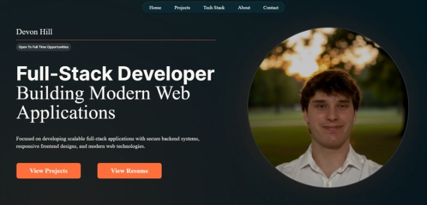

# Developer Portfolio

<p align="center">
  
</p>

<p align="center">
  A modern, interactive developer portfolio built with Next.js and designed to showcase my software engineering projects, technical skills, and experience.
</p>

## Overview

This portfolio was designed and developed from scratch to create a professional online presence and provide an interactive way to showcase my work. It features custom UI components, smooth animations, and a personalized design system built with modern frontend technologies.

The project focuses on creating a polished desktop experience while demonstrating my ability to build clean, maintainable, and visually engaging user interfaces.

## Features

- Desktop-focused layout optimized for laptop and desktop displays
- Designed for resolutions down to 1280x720
- Custom navigation bar and reusable React components
- Animated section transitions and interactive UI elements
- Project showcase with technology badges
- Technical skills section with categorized technologies
- Resume and contact links
- Custom color system, typography, and visual styling
- Smooth animations using Framer Motion

## Design Decisions

- Designed specifically for desktop and laptop screens to provide a more immersive portfolio experience
- Built reusable React components to maintain consistency and simplify future updates
- Used Tailwind CSS to create a custom design system with scalable styling patterns
- Implemented Framer Motion animations to create smooth interactions while maintaining performance
- Created custom UI elements and visual effects instead of relying entirely on pre-built components

## Tech Stack

### Frontend
- Next.js
- React
- TypeScript
- Tailwind CSS
- shadcn/ui
- Framer Motion

### Tools
- Git
- GitHub
- Vercel

## Getting Started

### Prerequisites

- Node.js (v18+)
- npm

### Installation

Clone the repository:

```bash
git clone https://github.com/Devon-Hill7/devon-portfolio.git
```
Navigate into the project directory:
```bash
cd client
```
Install Dependencies:
```bash
npm install
```
Start the development server:
```bash
npm run dev
```
Open your browser and visit:
```bash
http://localhost:3000
```

### Deployment
This project is deployed using vercel<br>
Live Demo: https://devonhill.vercel.app/

### Author
Devon Hill
- LinkedIn: https://www.linkedin.com/in/devon-hill-3958431b8/
- Portfolio: https://devonhill.vercel.app/
- Email: devonhill7@outlook.com
